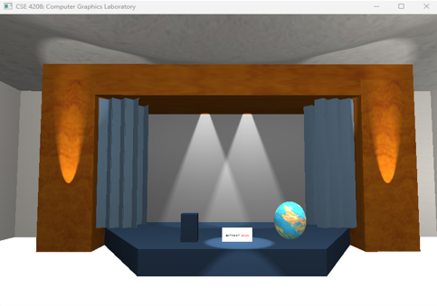

<h1>3D Auditorium Design with Exterior using OpenGL</h1>

<h2>Description</h2>

  This project showcases the design and rendering of a realistic 3D auditorium environment using <strong>OpenGL</strong>. It includes both interior and exterior architectural elements such as curved walls, stage, seats, lighting, and dynamic surroundings. Users can interact with the environment using camera controls, and enjoy a visually immersive experience enhanced by advanced lighting models, textures, and animations.

<strong>Key features:</strong>
<ul>
  <li>3D model of an auditorium with stage, curved ceiling, and structured seat arrangements.</li>
  <li>Parabolic and Bezier-based geometries for walls and ceilings.</li>
  <li>Dynamic lighting effects: point light, directional light, and spotlight.</li>
  <li>Realistic textures for walls, floors, grass, roads, stage curtains, and more.</li>
  <li>Interactive components: rotatable sphere and animated moving car.</li>
  <li>Procedural fractal tree generation with cylindrical pots.</li>
</ul>

<h2>Technologies Used</h2>
<ul>
  <li><strong>OpenGL (v3.3)</strong>: For rendering 3D graphics and managing real-time scenes.</li>
  <li><strong>GLFW</strong>: For creating windows and handling user input (keyboard/mouse).</li>
  <li><strong>GLAD</strong>: For managing OpenGL function pointers.</li>
  <li><strong>stb_image</strong>: To load texture images for mapping on 3D surfaces.</li>
  <li><strong>GLM</strong>: For mathematical operations like transformations, vectors, and matrices.</li>
  <li><strong>Shader Programs</strong>: Used for implementing lighting and material effects via vertex and fragment shaders.</li>
</ul>

<h2>Project Screenshots</h2>

   
  <em>Fig 1: Complete View of 3D Auditorium</em>
     

   
  <em>Fig 2: Stage Design</em>
     

   
  <em>Fig 3: Seat Arrangements</em>
     

   
  <em>Fig 4: Parabolic Curved Wall</em>
     

   
  <em>Fig 5: Curve Ceiling Using Bezier Curve</em>
     

   
  <em>Fig 6: Point Light Effect</em>
     

   
  <em>Fig 7: Directional Light Effect</em>
     

   
  <em>Fig 8: Spot Light Effect</em>
     

   
  <em>Fig 9: Rotatable Sphere Object</em>
     

   
  <em>Fig 10: Car as Dynamic Object</em>
     

   
  <em>Fig 11: Fractal Tree with Cylindrical Tree Pot</em>
     

<h2>🎬 Video Demonstration</h2>

  📽️ [Click here to watch the video demonstration]
  <a href="https://youtu.be/oAObcHvF0cI?si=o5YkPCypYWIjOhOJ" target="_blank">
    Project Video Demonstration
  </a>
   
     

